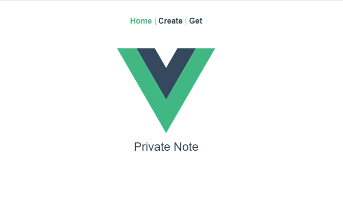
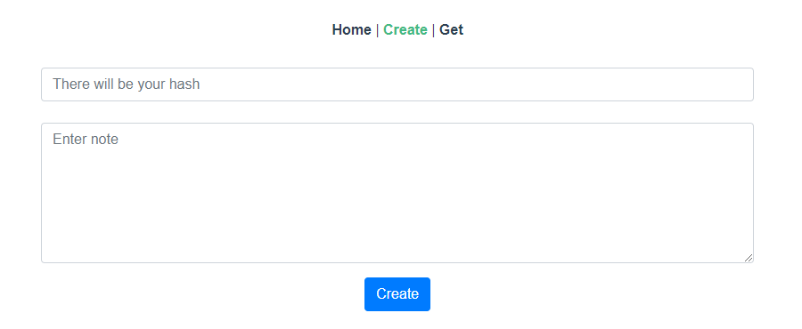
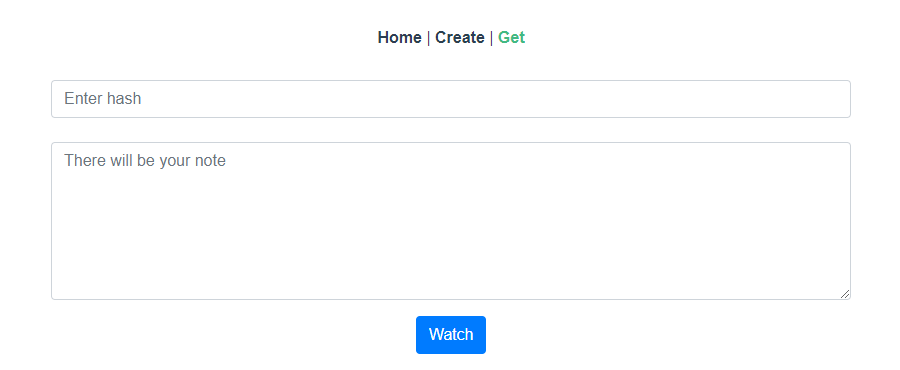

# Private Note

Send notes that will self-destruct after being read

 
 

## Requirements

- Vue CLI v3.x or later.
- Nodejs v10.x or later.
- **Visual Studio 2019** or **Rider**

### Local Environment

- Select `PrivateNote.Api` project "**Set as Startup Project**"
- Define connection string for your database in `PrivateNote.Api/appsettings.json`
- Run(F5 or CTRL+F5) `PrivateNote.Api` project first 
- Select `PrivateNote.Vue` project "**Set as Startup Project**"
- Define the url link to the Web API (hard-coded value **https://localhost:35050/**)
- Edit Vue.js views in `PrivateNote.Vue/client-app/src/views` with your **Web API url** on callbacks `axios.get` and `axios`
- Run(F5 or CTRL+F5) `PrivateNote.Vue` project

## Vue Application Screenshots

### Home Page

### Create Page

### Get Page

